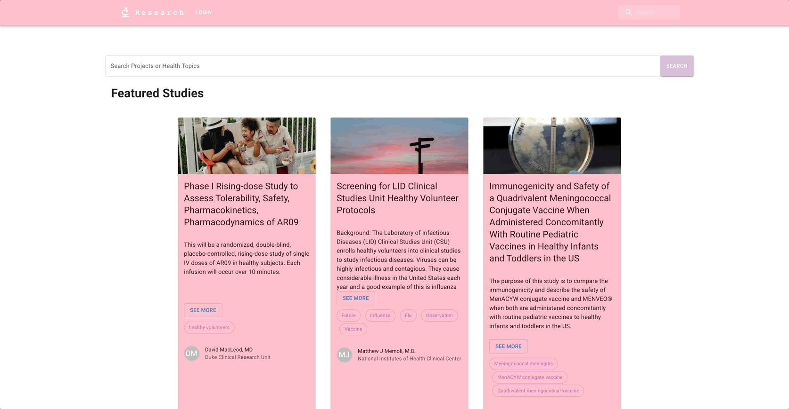
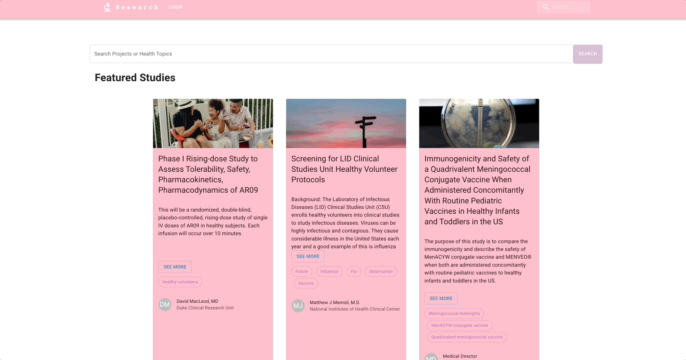
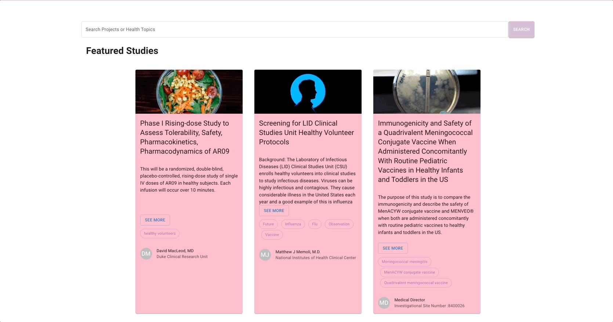
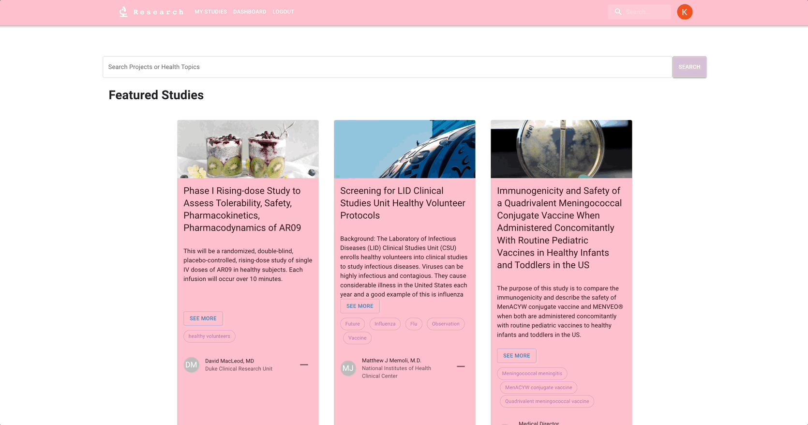
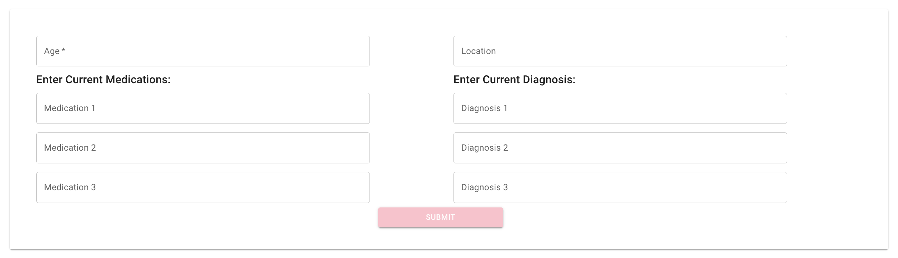

# Research You :microscope:

Research You is an innovative clinical research application that enables users to easily search for and be matched with local research studies they may be eligible for. With a streamlined and user-friendly design, users can quickly and easily find research studies that fit their interests and qualifications. The app allows users to save the research studies to their profile and view them at any time. I hope to add more features in the future, including making it easy for users to contact the research study teams directly, allowing for a more efficient and personalized experience. With this application, users can now easily find and participate in research studies that are right for them.

## Table of Contents

- [Getting Started](#getting-started)
  - [Pre-Installation Requirements](#pre-installation-requirements)
  - [Environment Variables Management](#environment-variables-management)
  - [Installation](#installation)
- [Product Features](#product-features)
  - [Home Page](#home-page)
  - [Login](#login)
  - [Search](#search)
  - [Saved Studies](#saved-studies)
  - [Form](#form)

- [Tech Stack](#tech-stack)

## Getting Started

These instructions will get you a copy of the project up and running on your local machine for development and testing purposes.

## Pre-Installation Requirements

```
Node v16.14.2
NPM v8.5.0
```

## Environment Variables Management

This project uses [dotenv](https://github.com/motdotla/dotenv).

The environment variables needed are inside the .example-env file. Simply copy the file, remove the 'example-' part of the file name and input the required values of your access tokens and port number you wish to use.

## Installation

Installs dependencies
```
npm install
```
Starts server
```
npm run server
```
Compiles code
```
npm run dev
```

## Product Features

### Home Page

> Users are greeted with featured research studies


### Login

> Users can login in with either their Google, Facebook, or Github Credentials


### Search

> Users can search for studies based on specified interests by entering a keyword in the search bar, or clicking on a tag




### Saved Studies

> Users can save studies to their profile for review or access later. They are saved to their account, so upon re-entering the website, their previously saved studies will populate until removed by user.



> Can add or remove the saved studies


### Form

> Can enter personal Information to check against study eligibility requirements. Please note this is a practice/test application. No HIPAA violations.


## Tech Stack


